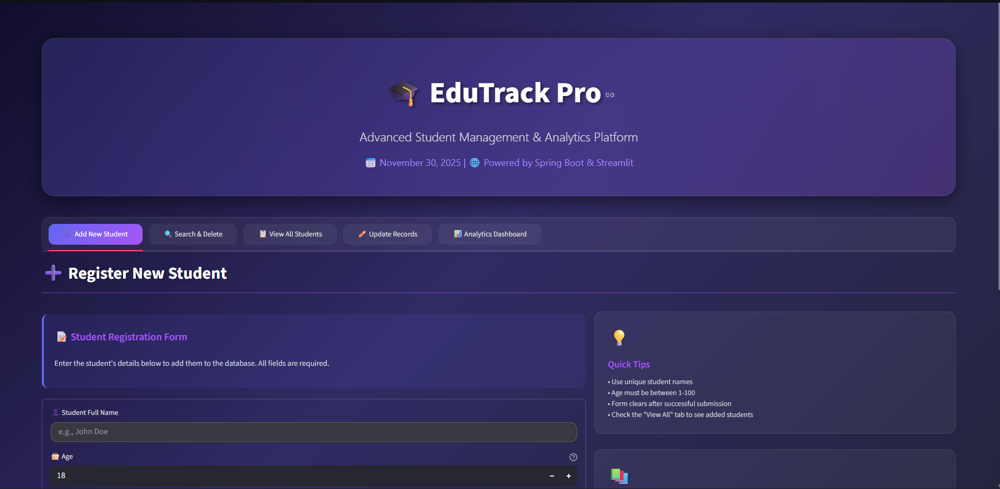
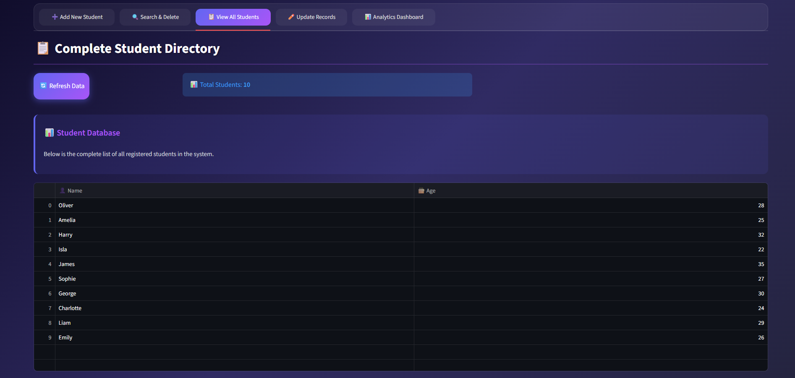
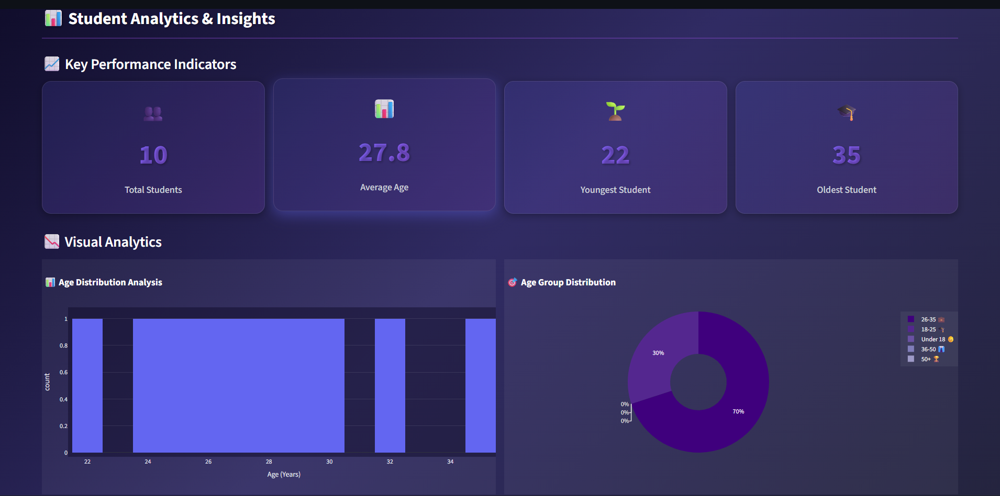

# 🎓 EduTrack Pro — Student Admin Panel

<p align="left">
  
  
  
  
  
  
</p>

<!-- <p align="center">
  
  
  
</p>

---

<p align="center">
  
  
  
</p> -->

---

## 🌟 Overview

**EduTrack Pro** is a modern Student Management System combining a **Spring Boot backend** with a **Streamlit frontend**, delivering a dark glassmorphism UI, real-time analytics, and seamless CRUD operations.
This project is built for scalability, deployment readiness, and beautiful user experience.


## ✨ Features

### 🎯 Core Features

* Add, update, delete, and search student records
* View all students in a clean tabular layout
* Export student data as CSV

### 📊 Analytics Dashboard

* Age distribution visualization
* Age segmentation
* Top 10 oldest student ranking
* Statistical summaries

### 🎨 UI / UX

* Dark theme with glassmorphism aesthetics
* Responsive layouts
* Smooth and minimalistic user experience


## 🛠 Tech Stack

### Backend

* Java 11
* Spring Boot 2.6.4
* Spring Data JPA
* MySQL / H2

### Frontend

* Python 3
* Streamlit
* Requests
* Pandas
* Plotly


## 📁 Project Structure

```
student-admin-panel/
├── src/                          
│   ├── main/
│   │   ├── java/                 
│   │   └── resources/            
│   └── test/                     
├── frontend/                     
│   ├── app.py                    
│   └── requirements.txt
├── images/          
├── pom.xml                       
├── Frontend.md                   
├── Backend.md                    
└── README.md                     
```

➡️ **Detailed documentation available in the Wiki**

---

## 📚 Documentation

All commands, installations, deployment steps, and architecture details are available inside the **GitHub Wiki**:

📘 **Visit Wiki →** *https://github.com/Swinalwaghmare/student-admin-panel/wiki*

Wiki includes:

* Getting Started
* Architecture 
* Backend Guide
* Frontend Guide

---

## 🖼️ Screenshots
### 🎬 Dashboard


### 📃 Student List


### ➕ Add Student


### 📊 Analytics


---

## 🤝 **Contributing**

We welcome contributions!
Feel free to:

* Open issues
* Suggest features
* Create pull requests

💡 PRs are always welcome!


---

<p style="text-align:center; font-size:25px; font-weight: bold">
  Made with ❤️ using Spring Boot & Streamlit
<p>
